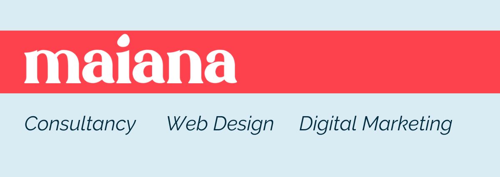

<h2 align='center'>Maiana</h2>
 
This website was created for the Maiana brand. This brand was developed as part of my master's thesis in Entrepreneurship and Business Creation.

This website was written following project "Landing page" of the course "Curso de Python 3 do básico ao avançado - com projetos reais".

<<<<<<< HEAD

=======
>>>>>>> 5991dba313f42a1fded3379bd8b316f1ce6c4d89
### Link

+ [Maiana Website](https://maiana.netlify.app/)

<<<<<<< HEAD


=======
>>>>>>> 5991dba313f42a1fded3379bd8b316f1ce6c4d89
### What's included

Within the download of this repository, you'll find the following directories and files:

```
Maiana_Website/
├── assets/
|   ├── css/
|   |   └── style.css
|   └── img/
|
└── index.html

 ```
 [](https://app.netlify.com/sites/maiana/deploys)

### Tools

+ images: https://unsplash.com/
+ Html
+ Css
